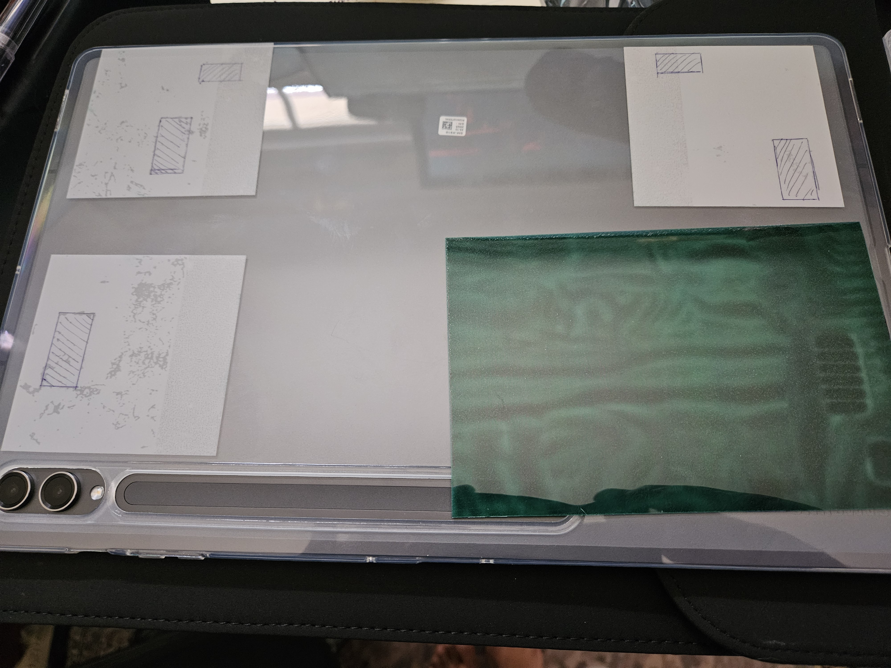

# Background

I really loved the [Microsoft Surface Pro kickstand](https://drive.google.com/file/d/1GFqqAlzLuvgCJUin3ISS65RPwMl-3D0K/view?usp=sharing), with it's variable angle and low profile. When I got a Galaxy Tab S9 ultra, I was disappointed to see there wasn't an affordable option - Samsung's own [Book Cover Keyboard](https://www.samsung.com/us/mobile/mobile-accessories/tablets/galaxy-tab-s9-ultra-book-cover-keyboard-ef-dx915ubeguj/) costs $350 currently, and I did not want to shell out that much on an already expensive tablet - plus I didn't care about the keyboard.

# BOM

| part                           | quantity | notes                                                                                                          |
| ------------------------------ | -------- | -------------------------------------------------------------------------------------------------------------- |
| 10x5x2mm magnets | 32 | https://a.co/d/7UNIeGb - these were pretty strong and come in a 100 pack |
| 25mm M3 socket head cap screws | 4        | for the hinge                                                                                                  |
| M3 nylock nuts                 | 4        | for the hinge                                                                                                  |
| 16mm M3 socket head cap screw  | 1        | for joining the kickstand pieces together                                                                      |
| M3 nut                         | 1        | for joining the kickstand pieces together                                                                      |
| _M3 Threaded Rod x 300mm_      | 1        | optional but **recommended** - adds stability when joining the kickstand pieces together (can use any 3mm rod) |

# Assembly

> view the fusion assembly (.f3d) for how the pieces fit together, leave an issue/comment if you have questions!
   - [Fusion assembly](https://a360.co/3OwZ8lM)
   - [Fusion f3d file](./galaxy-tab-s9-ultra-kickstand.f3d)

### Steps
1. attach the kickstandLeft and kickstandRight pieces to each other, inserting the 3mm rod if you have it
2. secure the kickstand to the mount hinges
	- you'll need some pliers or a small wrench to hold the nut while you tighten it.
3. place the whole assembly on the back of your tablet so the bottom of the kickstand lines up with the bottom of the tablet
4. place the magnets into the slots, the big slots take 6 magnets, the smaller take 4. I'd recommend some superglue or tape over them for the long term
	- the magnets on the s9 ultra are alternating polarity, here's what you can see with magnet paper:
	- 

# Videos

- adjustability: https://drive.google.com/file/d/1G3xtUA_Z0Y2sHJu3z1j3H9Qrw46Rhgov/preview
- how the magnetic attachment looks: https://drive.google.com/file/d/1GO41lvPYpuyF4cRh_Cl84gGd7RJG39y1/preview

# Images

