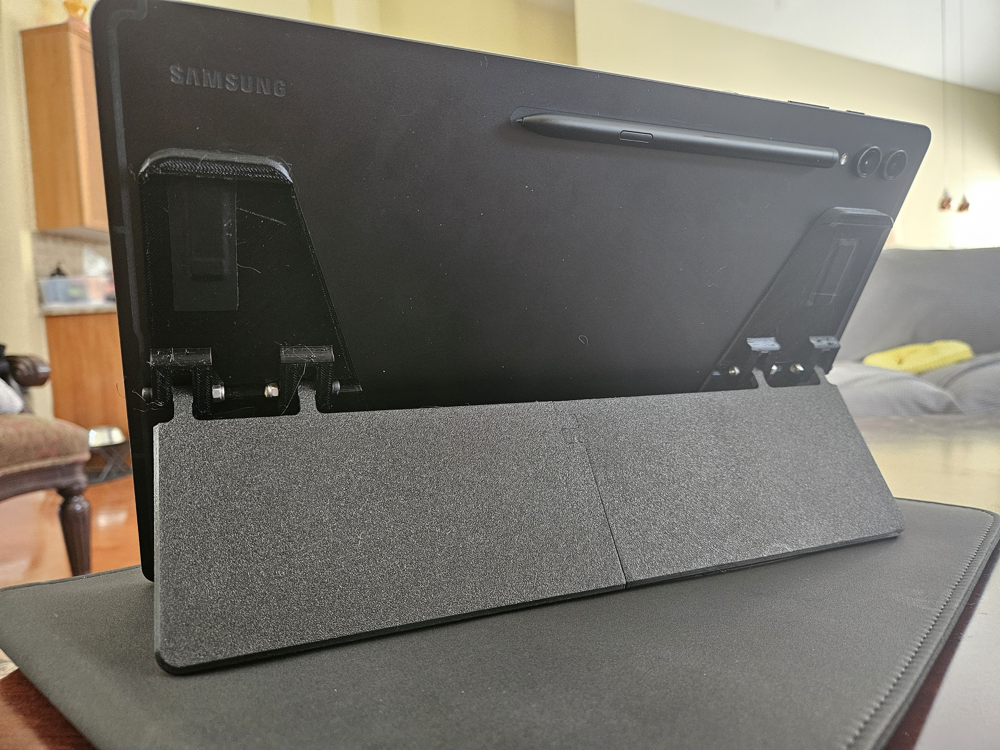
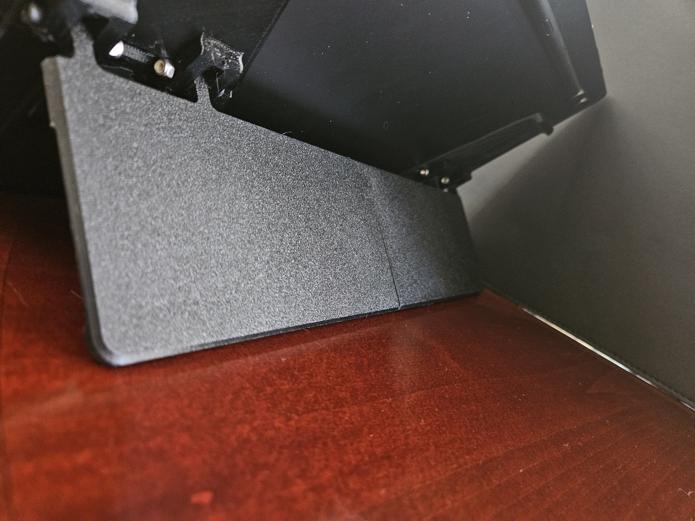

# Background

I really loved the [Microsoft Surface Pro kickstand](https://drive.google.com/file/d/1GFqqAlzLuvgCJUin3ISS65RPwMl-3D0K/view?usp=sharing), with it's variable angle and low profile. When I got a Galaxy Tab S9 ultra, I was disappointed to see there wasn't an affordable option - Samsung's own [Book Cover Keyboard](https://www.samsung.com/us/mobile/mobile-accessories/tablets/galaxy-tab-s9-ultra-book-cover-keyboard-ef-dx915ubeguj/) costs $350 currently, and I did not want to shell out that much on an already expensive tablet - plus I didn't care about the keyboard.

# Design Process

1. Mapped out the magnets using magnet paper and some post-its
   - [magnet locations](media/s9-ultra-magnets.jpg)
2. Brought that into Fusion 360 to design and iterate
   - [Fusion assembly](https://a360.co/3OwZ8lM)
   - [Fusion f3d file](./galaxy-tab-s9-ultra-kickstand.f3d)

# BOM

| part                           | quantity | notes                                                                                                          |
| ------------------------------ | -------- | -------------------------------------------------------------------------------------------------------------- |
| 10x5x2mm magnets | 32 | https://a.co/d/7UNIeGb - these were pretty strong |
| 25mm M3 socket head cap screws | 4        | for the hinge                                                                                                  |
| M3 nylock nuts                 | 4        | for the hinge                                                                                                  |
| 16mm M3 socket head cap screw  | 1        | for joining the kickstand pieces together                                                                      |
| M3 nut                         | 1        | for joining the kickstand pieces together                                                                      |
| _M3 Threaded Rod x 300mm_      | 1        | optional but **recommended** - adds stability when joining the kickstand pieces together (can use any 3mm rod) |

# Videos/Images

adjustability: https://drive.google.com/file/d/1G3xtUA_Z0Y2sHJu3z1j3H9Qrw46Rhgov/preview

magnetic attachment: https://drive.google.com/file/d/1GO41lvPYpuyF4cRh_Cl84gGd7RJG39y1/preview

